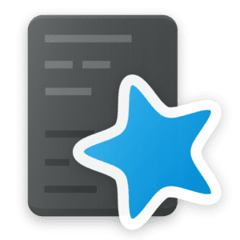
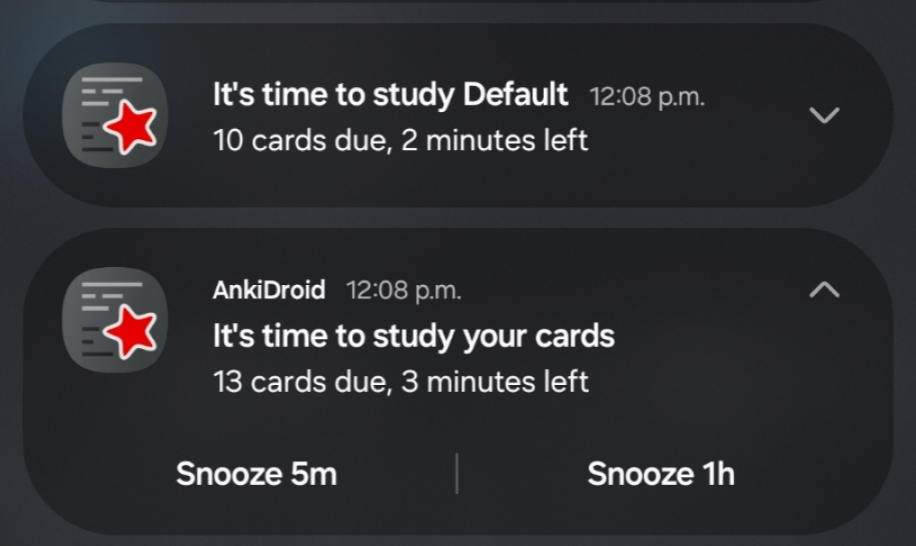
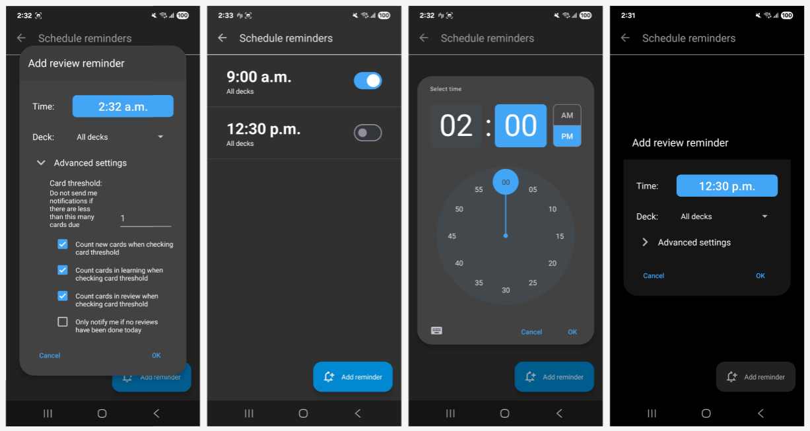
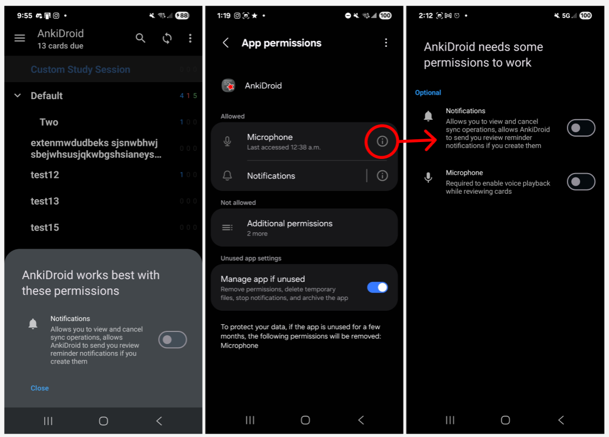
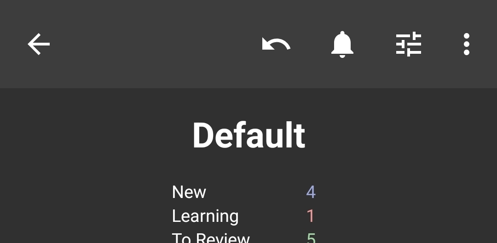
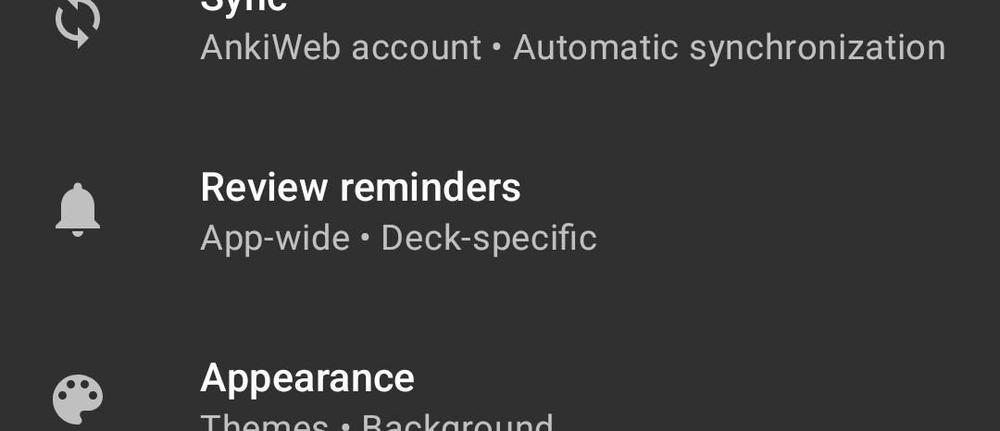
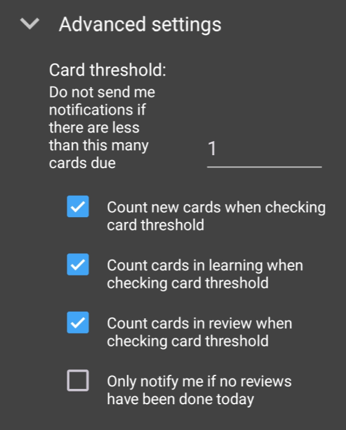

    
    
    <h1>
        Google Summer of Code (GSoC) 2025
         
        AnkiDroid
         
        Review Reminders
         
        Song "Eric" Yu Li (<em>ericli3690</em>)
         
         
    </h1>

## About Me 🙂

Hi, I'm **Eric**! As of writing, I'm a **Computer Science** student at the **University of Waterloo** in Canada. Feel free to reach out!
* **[Website](https://ericli3690.github.io/)**
* [LinkedIn](https://www.linkedin.com/in/song-eric-li/)
* [GitHub](https://github.com/ericli3690)

## My Mentors 🙏

Thanks to my mentors for guiding me, reviewing my code, and being super supportive for the entire summer!

* [Arthur Milchior](https://github.com/Arthur-Milchior)
* [Ashish Yadav / criticalAY](https://github.com/criticalAY)

Extra shoutout to the other maintainers of AnkiDroid, too. Even though they weren't formally my mentors, they also helped guide and support me, and for that I am eternally grateful.

* [David Allison](https://github.com/david-allison)
* [Brayan Oliveira / BrayanDSO](https://github.com/BrayanDSO)
* [Shridhar Goel](https://github.com/ShridharGoel)
* [Sanjay Sargam](https://github.com/SanjaySargam)
* [Mike Hardy](https://github.com/mikehardy)
* [lukstbit](https://github.com/lukstbit)
* Anyone else I'm forgetting!

## About GSoC ☀️ and AnkiDroid ⭐

Learn more about GSoC [here](https://summerofcode.withgoogle.com/).

See **[AnkiDroid on GitHub](https://github.com/ankidroid/Anki-Android)**!

You may have heard of [Anki](https://apps.ankiweb.net/), one of the most popular spaced-repetition flashcards apps in the world. **AnkiDroid** is the official open-source Android mobile port of Anki, with over ten million downloads on Google Play. I personally have been using Anki and AnkiDroid for years to study for school, learn Chinese characters, etc.

## Project Goals 🎯

See [my original project proposal document](https://docs.google.com/document/d/1KMjnm6ol1M_VMAsg9V5Qb4XRZnEON-39gkzLkFe8q2Y/edit?tab=t.0#heading=h.e0ji9i3xyoc6).

For my GSoC project, I proposed adding **review reminders** to AnkiDroid, as the current notifications system was completely broken and had been for multiple years. Quoting from my proposal (with emojis added to indicate which features I completed):

> In summary, my key goals are as follows:
> 
> 1. Be able to create deck-specific reminders which fire once per day ✅ 
> 2. Be able to view reminders in a specific deck ✅
> 3. Be able to view reminders app-wide on a single screen ✅
> 4. Be able to receive notifications in a timely manner ✅
> 5. Be able to edit the time a reminder is sent at ✅
> 6. Be able to delete reminders ✅
> 7. Be able to ask the user for notification permissions ✅
> 8. Be able to create global, app-wide notifications ✅
> 
> If possible, I also plan to implement the following:
> 
> 9. Be able to view previews of cards in notifications ❌ *(not met because, after a maintainer debate, we decided it was better off as an add-on feature rather than one that should be included in the vanilla app)*
> 10. Be able to create persistent notifications that have a defined start and end ✅ *(met in a different way than originally planned: we decided creating two types of review reminders (single and persistent) was too confusing. Instead, I added two simple snooze buttons to the review reminder notifications)*
> 11. Be able to modify special options for notifications, such as including subdecks when counting cards for the card trigger threshold ✅ *(this specific advanced option was removed for adding unnecessary complexity, but other advanced options were implemented)*

For more details about how my project changed from the initial proposal, see [Plan Changes](#plan-changes).

## Project Results ✨

### GIFs

Here's a demonstration of how the new review reminders feature allows you to schedule, view, edit, and delete review reminders:

 Deleting a deck also deletes the corresponding review reminders:

### Images

When you receive reminder notifications, they look like this:

 Clicking snooze dismisses the notification and causes it to come back after the selected time interval. Clicking on the notification opens the corresponding deck and allows you to begin reviewing.

Here are some images of the main UI screens:

 I also created dialogs and screens for explaining to the user why AnkiDroid needs the notification permission:

 There are multiple ways to access the review reminders screen to ensure new users don't get stuck looking for it:

  

 I also added a few advanced review reminder configuration settings:

 

1. Count new cards / cards in learning / cards in review: review reminders only trigger for a deck if the number of cards due in the deck exceeds the "card trigger threshold". For example, if you have ten cards due on a certain day, but the threshold is 20 cards, then no review reminder will be sent. However, there are different kinds of cards: new cards, cards in learning, and cards in review. This advanced option allows you to filter by certain cards when checking if the threshold is reached. For example, if a user wants to only get notifications if they have a lot of cards to *review*, but otherwise does not care if they have *new* cards to review, then they can un-check the "count new cards when checking card threshold" advanced option.

2. Only notify me if no reviews have been done today: If a user dislikes receiving notifications and only wants to receive them if they are about to forget to review, they can toggle this advanced setting on. This ensures they only get notifications if they really need them, minimizing notification spam.

## Pull Requests 🧑‍💻

While I filed other PRs during the summer, the following are the ones which are directly related to the review reminders feature. As of writing, a few stragglers are still awaiting review: see [Next Steps](#next-steps) for more information.

1. [feat(reminders): entry points](https://github.com/ankidroid/Anki-Android/pull/18318)
2. [feat(reminders): developer option](https://github.com/ankidroid/Anki-Android/pull/18327)
3. [feat(reminders): ReviewRemindersDatabase and ReviewReminder](https://github.com/ankidroid/Anki-Android/pull/18364)
4. [style: improve docstrings](https://github.com/ankidroid/Anki-Android/pull/18827)
5. [refactor: prefs for entry points](https://github.com/ankidroid/Anki-Android/pull/18828)
6. [refactor: ReviewReminderScope](https://github.com/ankidroid/Anki-Android/pull/18829)
7. [refactor: remove granular snooze settings](https://github.com/ankidroid/Anki-Android/pull/18850)
8. [refactor: clean up ReviewReminderScope.DeckSpecific.getDeckName](https://github.com/ankidroid/Anki-Android/pull/18851)
9. [refactor: make DeckDropDownAdapter SubtitleListener cast safe](https://github.com/ankidroid/Anki-Android/pull/18852)
10. [refactor: delete bulk deletion, use separate prefs file](https://github.com/ankidroid/Anki-Android/pull/18853)
11. [feat(reminders): add ScheduleReminders DeckSpinner init method](https://github.com/ankidroid/Anki-Android/pull/18854)
12. [feat(reminders): RecyclerView XML](https://github.com/ankidroid/Anki-Android/pull/18855)
13. [feat(reminders): ReviewReminder schema migration](https://github.com/ankidroid/Anki-Android/pull/18856)
14. [feat(reminders): make ReviewReminder Parcelable](https://github.com/ankidroid/Anki-Android/pull/18866)
15. [refactor: prepare BootService for review reminders](https://github.com/ankidroid/Anki-Android/pull/18939)
16. [refactor: prepare AnkiDroidApp, widget, and day-rollover for review reminders](https://github.com/ankidroid/Anki-Android/pull/18946)
17. [feat(reminders): review reminders RecyclerView](https://github.com/ankidroid/Anki-Android/pull/18964)
18. [improvement: permission explanations](https://github.com/ankidroid/Anki-Android/pull/18978)
19. [refactor: prepare AnkiActivity for review reminders](https://github.com/ankidroid/Anki-Android/pull/19047)
20. [feat(reminders): handle deck deletion](https://github.com/ankidroid/Anki-Android/pull/19065)
21. [feat(reminders): AddEditReminderDialog](https://github.com/ankidroid/Anki-Android/pull/19109)
22. [refactor: delete ReminderService](https://github.com/ankidroid/Anki-Android/pull/19114)
23. [feat(reminders): create global scope helper](https://github.com/ankidroid/Anki-Android/pull/19115)
24. [refactor(reminders): create allDecksCounts](https://github.com/ankidroid/Anki-Android/pull/19116)
25. [feat(reminders): create notification channel](https://github.com/ankidroid/Anki-Android/pull/19117)
26. [feat(reminders): AlarmManagerService and NotificationService](https://github.com/ankidroid/Anki-Android/pull/19118)
27. [feat(reminders): set alarms from ScheduleReminders](https://github.com/ankidroid/Anki-Android/pull/19119)
28. [improvement: delete TiramisuPermissionsFragment and streamline PermissionsItem](https://github.com/ankidroid/Anki-Android/pull/19149)
29. [feat(reminders): threshold filters](https://github.com/ankidroid/Anki-Android/pull/19156)
30. [feat(reminders): only notify if no reviews](https://github.com/ankidroid/Anki-Android/pull/19157)
31. [feat(reminders): request notification permissions](https://github.com/ankidroid/Anki-Android/pull/19167)

## Highlights 💭

One of the major highlights of this project for me was handling ReviewReminder schema migration: basically, making sure the app wouldn't crash if a future developer decided to change the fields of the ReviewReminder data class stored in user devices. There were many unanticipated things I coded which I didn't expect to implement back in May, but this was the biggest unanticipated feature of the bunch. Nonetheless, I'm very happy the way I [solved the problem](https://github.com/ankidroid/Anki-Android/pull/18856), complete with unit tests, and I hope that it will help future developers work with the code I've written.

It took a lot of time to get the UI for the [AddEditReminderDialog](https://github.com/ankidroid/Anki-Android/pull/19109) right, especially because I ran into multiple bugs with implementing the MaterialUI TimePicker, but I eventually figured it all out. I'm very happy with the final visual result.

I learned a lot about writing good documentation while working on this project. With all the back-and-forth involved with reviewing code in an open source project, I'm quite confident this is some of the highest quality code I've ever written in my life.

## Plan Changes 🔁

The project changed a bit from the [initial plan](https://docs.google.com/document/d/1KMjnm6ol1M_VMAsg9V5Qb4XRZnEON-39gkzLkFe8q2Y/edit?tab=t.0#heading=h.e0ji9i3xyoc6) as I worked on the code and discussed with my mentors regarding which features I should implement and which features were unnecessary.

* Criteria 9 was not met because, after a maintainer debate, we decided it was better off as an add-on feature rather than one that should be included in the vanilla app.
* Criteria 10 was met in a different way than originally planned: we decided creating two types of review reminders (single and persistent) was too confusing. Instead, I added two simple snooze buttons to the review reminder notifications. This feature changed a lot over the course of the summer. At various points in June and July, we were planning to have snooze settings for each individual reminder, an app-wide snooze setting...
* The UI for the main review reminder editing screen was simplified and unnecessary features like multi-select deletion were removed. The UI for the AddEditReminderDialog was greatly simplified and streamlined so that users can easily edit which deck a review reminder is associated with, move review reminders around, etc.
* Regarding Criteria 11: some of the advanced options, such as "Include cards from subdecks", were removed for being overly confusing. We decided to focus on providing clean defaults rather than allowing for infinite customizability.
* Instead of adding Preferences Datastore as a new import to store review reminders, we decided to use the raw Preferences system instead, avoiding the introduction of a new dependency.
* Snoozing was accomplished via AlarmManager instead of WorkManager as originally planned due to AlarmManager's scheduling behaviour being more predictable.

## Next Steps ➡️

While I've fulfilled all of the things I set forth in my original project proposal, there's still a few things I've thought of over the course of this summer and which I still would like to add:

1. Add a button in the toolbar of ScheduleReminders linking to the OS permissions screen
2. Refactor ScheduleReminders to use a PermissionsActivity instead of SingleFragmentActivity to minimize the use of new Activities
3. Clean up the strings and move them into the resource files to facilitate translation
4. Set up a logging service to help with bug reports
5. Write some instrumented tests
6. Handle locale changes for notification channels to address [this recently-opened issue](https://github.com/ankidroid/Anki-Android/issues/19048)
7. Maybe create a "are you having trouble with notifications" page to help people who aren't receiving notifications troubleshoot what's going wrong.

And of course, some of my PRs are still awaiting being merged. Over the next few months, I hope to revise them and fully merge my changes into main, implement the above features, and patch any bugs that show up in my code during beta testing.

Looking forward to getting review reminders into a stable release and pushing it out to all of AnkiDroid's users!